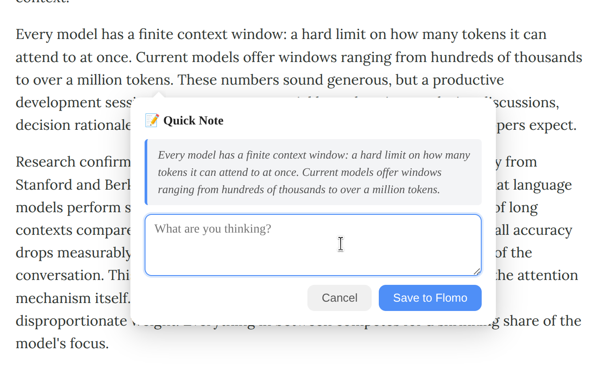

# Screen Notes

Capture notes from selected text and send them to Flomo, with optional X draft creation on macOS.

This project now has two main surfaces:

- a **browser extension** for notes from web pages
- a **macOS Quick Action** for notes from selected text in compatible macOS apps



## What it does

`screen-notes` helps you keep the original selected text as context, add your own note, and save the result to Flomo with a lightweight UI that stays close to what you were reading.

### Browser extension

- Right-click selected text on a web page and open the note flow
- Use an inline floating bubble when page injection is available
- Fall back to a separate extension note window when needed
- Save to Flomo through webhook configuration
- Browse recent saved notes from the extension popup

### macOS Quick Action

- Trigger `Take Notes` from **Quick Actions / Services** in supported macOS apps
- Works with selected text from Preview, browsers, reader apps, emails，and other compatible apps
- Show a native macOS note window with selected-text context
- Save to Flomo and include source context automatically
- Optionally open an X draft from the same note window
- Show success/failure feedback through the macOS flow

## Installation

You can use either surface independently, or use both together.

### 1) Browser extension setup

1. Clone or download this repository.
2. Open `chrome://extensions` in Chrome.
3. Enable **Developer mode**.
4. Click **Load unpacked** and select the project folder.
5. Open the extension settings from the extension popup.
6. Select **Flomo** and paste your webhook URL.

### 2) macOS Quick Action setup

From the project root:

```bash
./mac/scripts/configure-flomo-webhook.sh "https://flomoapp.com/iwh/xxxxx/yyyyy/"
./mac/scripts/install-quick-action.sh
```

This installs the Quick Action workflow and the runtime script under:

- `~/Library/Services/Take Notes.workflow`
- `~/Library/Application Support/ScreenNotesMac/take-notes-service.sh`

If you want to use the macOS `Also post to X` checkbox too, install Chrome (or Chromium/Edge) plus `bun` or Node.js with `npx`. The install script now bundles the patched `baoyu-post-to-x` skill into `~/Library/Application Support/ScreenNotesMac/skills/baoyu-post-to-x`.

See [`mac/README.md`](mac/README.md) for the macOS setup and usage guide.

### Getting your Flomo webhook URL

Go to [Flomo](https://flomoapp.com) → Settings → API and copy the webhook URL that starts with `https://flomoapp.com/iwh/...`.

## Usage

### Browser extension flow

1. Select text on a web page.
2. Right-click and choose **Take quick notes**.
3. Write your note in the floating bubble or fallback window.
4. Save the note to Flomo.

### macOS Quick Action flow

1. Select text in a compatible macOS app.
2. Open **Quick Actions** or **Services** and choose **Take Notes**.
3. Write your note in the native macOS panel.
4. Optionally check **Also post to X**.
5. Save the note to Flomo.
6. If checked, review and publish the opened X draft in Chrome.

If the macOS action is hard to reach from the context menu, assign a keyboard shortcut in `System Settings > Keyboard > Keyboard Shortcuts > Services`.

## Note formats

### Browser extension note format

```text
<selected text>

<your note>

<page URL>

#Web-Reading
```

### macOS Quick Action note format

```text
<selected text>

——————————

<your note>

<source document name or source app name>

#Mac-Reading
```

### macOS X draft format

```text
<selected text>

——————————

<your note>
```

## Project structure

```text
├── manifest.json           # Chrome extension manifest (V3)
├── background.js           # Extension orchestration and context menu flow
├── content.js              # In-page floating bubble UI
├── providers.js            # Note provider registry
├── storage.js              # Shared settings/history storage
├── note-service.js         # Shared browser note save workflow
├── popup.html/js           # Extension popup with recent notes
├── options.html/js         # Extension settings
├── note.html/js            # Fallback extension note window
├── styles.css              # Shared browser UI styles
├── mac/
│   ├── README.md           # macOS setup and usage guide
│   ├── skills/             # Bundled mac skills used by runtime
│   └── scripts/            # macOS install, config, and runtime scripts
├── docs/
│   └── mac-engineering-overview.md
└── .copilot/skills/        # Reusable design guidance used in this repo
```

## Adding a new provider

Add a new entry to `providers.js`:

```js
NoteProviders.notion = {
  id: "notion",
  name: "Notion",
  configFields: [
    { key: "apiKey", label: "API Key", type: "text", placeholder: "secret_...", hint: "..." }
  ],
  validate(cfg) { /* return { valid, error? } */ },
  buildContent(selectedText, userNote, pageUrl) { /* return string */ },
  async send(cfg, content) { /* POST to API */ }
};
```

If a provider needs a different API host, update `host_permissions` in `manifest.json` as well.

## Related docs

- [`mac/README.md`](mac/README.md)
- [`docs/mac-engineering-overview.md`](docs/mac-engineering-overview.md)

## License

See [LICENSE](LICENSE).
